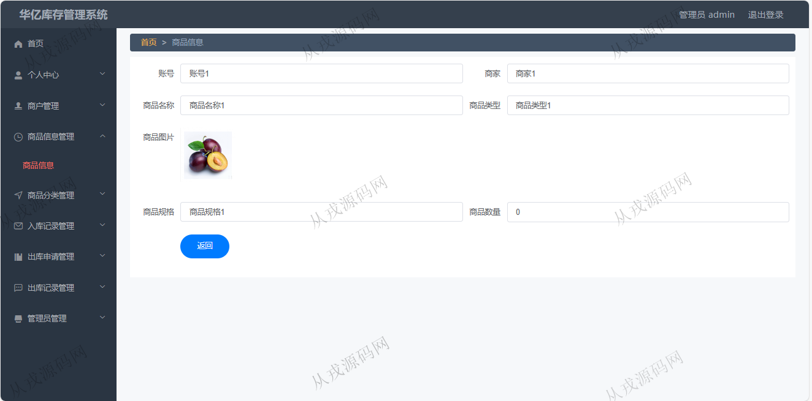

<h1 align="center">217.库存管理系统</h1>

 获取sql文件 QQ: 386869957 QQ群: 377586148 

 [更多源码项目: 从戎源码网](https://armycodes.com/) 

## 简介

> 本代码来源于网络,仅供学习参考使用!
>
> 提供1.远程部署/2.修改代码/3.设计文档指导/4.框架代码讲解等服务
>
> http://localhost:8080/ssmtdl73/admin/dist/index.html#/rukujilu
> 
> 管理员：admin 123456
> 
> 商户：商户1 123456
>

## 项目介绍
基于ssm+vue的库存管理系统：前端 vue、elementui，后端 maven、springmvc、spring、mybatis；角色分为管理员、商户；集成商户管理、商品信息管理、出入库管理等功能于一体的系统。

## 功能介绍

- 个人中心：个人信息查看与修改，密码修改
- 商户管理：商户信息的增删改查，按账号和商家名称搜索查询
- 商品信息管理：商品信息的增删改查，商品图片上传，商品入库，商品出库，达到商品预警条件触发弹框提示
- 商品分类管理：分类信息的增删改查
- 入库记录管理：入库记录列表查询，多条件搜索，修改和删除
- 出库申请管理：出库申请列表查询，修改，审核操作
- 出库记录管理：出库记录列表查询，多条件搜索，修改和删除
- 管理员管理：管理员信息的增删改查

## 环境

- <b>IntelliJ IDEA 2021.3</b>

- <b>Mysql 5.7.26</b>

- <b>Tomcat 7.0.73</b>

- <b>JDK 1.8</b>

## 运行截图

